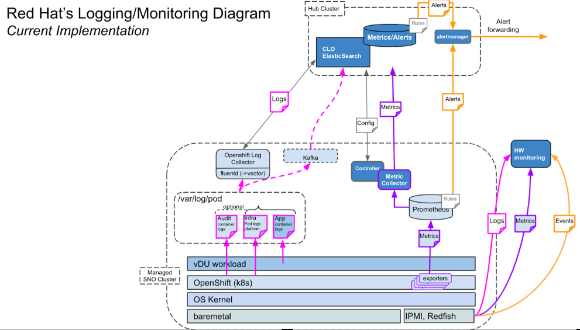

Table of Contents
=================

* [Table of Contents](#table-of-contents)
* [cluster-logging-hub-vector-forwarding](#cluster-logging-hub-vector-forwarding)
   * [Prerequisites](#prerequisites)
   * [OCP Logging stack architecture](#ocp-logging-stack-architecture)
   * [Logging Hub](#logging-hub)
      * [Deploy OpenShift Cluster-Logging and Elasticsearch Operators](#deploy-openshift-cluster-logging-and-elasticsearch-operators)
      * [Create Cluster Logging Custom Resource](#create-cluster-logging-custom-resource)
      * [Create Cluster Log Forwarder Custom Resource](#create-cluster-log-forwarder-custom-resource)
      * [Create External Elasticsearch Route to expose ES serivice for receiving logs from DU or CU clusters.](#create-external-elasticsearch-route-to-expose-es-serivice-for-receiving-logs-from-du-or-cu-clusters)
      * [Retrieve Elasticsearch Collector Secret For Client Log Forwarding](#retrieve-elasticsearch-collector-secret-for-client-log-forwarding)
   * [Logging Client](#logging-client)
      * [Deploy OpenShift Cluster-Logging Operator](#deploy-openshift-cluster-logging-operator)
      * [Create Cluster Logging Custom Resource](#create-cluster-logging-custom-resource-1)
      * [Create Cluster Log Forwarder Custom Resource](#create-cluster-log-forwarder-custom-resource-1)
   * [Vector Configuration From Collector POD](#vector-configuration-from-collector-pod)
   * [Limitation](#limitation)

# cluster-logging-hub-vector-forwarding
This repo will show how to use OpenShift Cluster-Logging Stack Vector as Forwarder instead of using Fluentd. From Client like DU/CU SNO/MMO Clusters can forward APP, AUDIT and INFRA Logs to centralize Logging-HUB to External Elasticsearch Server

## Prerequisites
In order to install and configure OpenShift Logging the following prerequisites must be met before starting the process.
Determining the supported Openshift Logging release according to the OCP version.

- OCP 4.12+
- OpenShift Logging subsystem v5.4+ but recommended to use v5.7+  
  Due to following features are enabled only on v5.7+ such as Syslog RFC3164, Syslog RFC5424 and HTTP  
- Centralize Hub-logging can be 1+0 or 3+0
- Check for Network requirements before starting, some specific ports must be accessible.
- Persistent storage is planned according to log size evaluation and retention time.
- FIPS disabled

**Note:** Vector does not support FIPS Enabled Clusters.  

---
- Vector's concept  
[Vector's Components](https://vector.dev/docs/about/concepts/)
- Vector's configuration  
  [Vector's sinks Configuration](https://vector.dev/docs/reference/configuration/sinks/vector/#configuration)
- Vector's [Configuration Sources](https://vector.dev/docs/reference/configuration/sources/)  
- OpenShift's Vector Features Comparision
  [collector-features](https://docs.openshift.com/container-platform/4.12/logging/cluster-logging.html#collector-features)
---

## OCP Logging stack architecture
Credit to Yang's diagram, it shows `fluentd` and `vector` as part of the OpenShift Cluster-Logging Stack.


Click [here](https://cloud.redhat.com/blog/introduction-to-the-openshift-4-logging-stack) to see the introduction of OCP4 Logging Stack Architecture

## Logging Hub 
### Deploy OpenShift Cluster-Logging and Elasticsearch Operators

- Create CLO Namespace 
```yaml
cat 01_clo_hub_ns.yaml 
apiVersion: v1
kind: Namespace
metadata:
  name: openshift-operators-redhat 
  annotations:
    openshift.io/node-selector: ""
  labels:
    openshift.io/cluster-monitoring: "true"
```
```shellSession
$ oc apply -f 01_clo_hub_ns.yaml
```

- Create CLO OperatorGroup 
02_clo_hub_og.yaml: 
```yaml
apiVersion: operators.coreos.com/v1
kind: OperatorGroup
metadata:
  name: cluster-logging
  namespace: openshift-logging
spec:
  targetNamespaces:
    - openshift-logging
```
```shellSession
$ oc apply -f 02_clo_hub_og.yaml
```
- Create CLO and Elasticsearch Subscriptions 
```yaml
apiVersion: operators.coreos.com/v1alpha1
kind: Subscription
metadata:
  name: cluster-logging
  namespace: openshift-logging 
spec:
  channel: "stable" 
  name: cluster-logging
  source: redhat-operators 
  sourceNamespace: openshift-marketplace
---
apiVersion: operators.coreos.com/v1alpha1
kind: Subscription
metadata:
  name: "elasticsearch-operator"
  namespace: "openshift-logging" 
spec:
  channel: "stable" 
  installPlanApproval: "Automatic" 
  source: "redhat-operators" 
  sourceNamespace: "openshift-marketplace"
  name: "elasticsearch-operator"
```
```shellSession
$ oc apply -f 03_clo_es_hub_subs.yaml
```
- Check CLO Operator POD Status 
```shellSession
$ oc get pod -n openshift-logging 
NAME                                            READY   STATUS      RESTARTS   AGE
cluster-logging-operator-594ddc54f9-5d995       1/1     Running     0          3d17h
```

### Create Cluster Logging Custom Resource
04_create_clo_hub_cr.yaml: 
```yaml
apiVersion: "logging.openshift.io/v1"
kind: ClusterLogging
metadata:
  name: instance
  namespace: openshift-logging
spec:
  collection:
    type: vector
  logStore:
    type: elasticsearch
    elasticsearch:
      nodeCount: 5
      storage:
        storageClassName: "ocs-storagecluster-cephfs"
        size: 200G
      resources: 
        limits:
          memory: "8Gi"
        requests:
          memory: "8Gi"
      proxy: 
        resources:
          limits:
            memory: 256Mi
          requests:
             memory: 256Mi
      redundancyPolicy: SingleRedundancy
    retentionPolicy: 
      application:
        maxAge: 7d
      infra:
        maxAge: 7d
      audit:
        maxAge: 7d
  managementState: Managed
  visualization:
    type: kibana
    kibana:
      replicas: 1
```
```shellSession
$ oc apply -f 04_create_clo_hub_cr.yaml
```
**Note:** The managementState `Unmanaged` is not allowed/supported from ES Log-Hub server, any changes are updated by user then CLO operator will reconcile back the changes.   

### Create Cluster Log Forwarder Custom Resource
05_create_clf_hub_cr.yaml: 
```yaml
apiVersion: logging.openshift.io/v1
kind: ClusterLogForwarder
metadata:
  name: instance
  namespace: openshift-logging
spec:
  outputs:
    - name: internal-es
      type: elasticsearch
      secret:
        name: collector
      url: 'https://elasticsearch.openshift-logging.svc:9200'
  pipelines:
    - name: nokia-logs
      inputRefs:
        - application
        - infrastructure
        - audit
      outputRefs:
        - internal-es
      labels:
        node: hub-logging
```
```shellSession
$ oc apply -f 05_create_clf_hub_cr.yaml
$ oc -n openshift-logging get po
NAME                                            READY   STATUS      RESTARTS   AGE
cluster-logging-operator-594ddc54f9-5d995       1/1     Running     0          3d17h
collector-7xvq9                                 2/2     Running     0          3d18h
collector-8js2m                                 2/2     Running     0          3d18h
collector-cgp7w                                 2/2     Running     0          3d18h
collector-gzm4j                                 2/2     Running     0          3d18h
collector-nxvcl                                 2/2     Running     0          3d18h
elasticsearch-cd-ch5wrfo4-1-6d6f48f9b7-q6hk9    2/2     Running     0          3d18h
elasticsearch-cd-ch5wrfo4-2-6f8fddbcd4-srdgs    2/2     Running     0          3d18h
elasticsearch-cdm-uh1o9nsh-1-cdd975db4-rr9jz    2/2     Running     0          3d18h
elasticsearch-cdm-uh1o9nsh-2-79d74fcb77-79dj2   2/2     Running     0          3d18h
elasticsearch-cdm-uh1o9nsh-3-5bbff5947d-qqb62   2/2     Running     0          3d18h
elasticsearch-im-app-28139955-tplgl             0/1     Completed   0          39s
elasticsearch-im-audit-28139955-np2n9           0/1     Completed   0          39s
elasticsearch-im-infra-28139955-sx7q2           0/1     Completed   0          39s
kibana-85fc695d79-ssq2k                         2/2     Running     0          3d18h
```

### Create External Elasticsearch Route to expose ES serivice for receiving logs from DU or CU clusters.
06_create_external_es_route_hub.yaml: 
```yaml
apiVersion: route.openshift.io/v1
kind: Route
metadata:
  name: elasticsearch-ext
  namespace: openshift-logging
spec:
  host:
  to:
    kind: Service
    name: elasticsearch
  tls:
    termination: passthrough
    insecureEdgeTerminationPolicy: Redirect
```
```shellSession
$ oc apply -f 06_create_external_es_route_hub.yaml
$ oc -n openshift-logging get route
NAME                HOST/PORT                                                                           PATH   SERVICES        PORT    TERMINATION            WILDCARD
elasticsearch-ext   elasticsearch-ext-openshift-logging.apps.abi.hubcluster-1.lab.eng.cert.redhat.com          elasticsearch   <all>   passthrough/Redirect   None
```

### Retrieve Elasticsearch Collector Secret For Client Log Forwarding
Export the collector TLS key and certificate. These key and certificate will be used on DU/CU clusters to forward logs to the Elasticsearch log store.

```shellSession
$ oc -n openshift-logging get secret > client_cert_secret.yaml
```

Note: The certificates and key are used from the ES collector secret, but the insecureSkipVerify flag must still be set to true for CU/DU clusters to forward logs to the Log Hub Store. It will be applied on the client cluster before create CLO CLF CR.


## Logging Client 
### Deploy OpenShift Cluster-Logging Operator
- Create CLO Namespace 
01_clo_client_ns.yaml: 
```yaml
apiVersion: v1
kind: Namespace
metadata:
  name: openshift-operators-redhat 
  annotations:
    openshift.io/node-selector: ""
  labels:
    openshift.io/cluster-monitoring: "true"
```
```shellSession
$ oc apply -f 01_clo_client_ns.yaml
```
- Create CLO OperatorGroup 
02_clo_client_og.yaml: 
```yaml
apiVersion: operators.coreos.com/v1
kind: OperatorGroup
metadata:
  name: cluster-logging
  namespace: openshift-logging
spec:
  targetNamespaces:
    - openshift-logging
```
```shellSession
$ oc apply -f 02_clo_client_og.yaml
```

- Create CLO Subscription 
03_clo_client_subs.yaml: 
```yaml
apiVersion: operators.coreos.com/v1alpha1
kind: Subscription
metadata:
  name: cluster-logging
  namespace: openshift-logging 
spec:
  channel: "stable" 
  name: cluster-logging
  source: redhat-operators 
  sourceNamespace: openshift-marketplace
```
```shellSession
$ oc apply -f 03_clo_client_subs.yaml
```

- Check CLO Operator POD Status
```shellSession
$ oc -n openshift-logging get pod
NAME                                        READY   STATUS    RESTARTS       AGE
cluster-logging-operator-697669ccc8-kcn67   1/1     Running   6 (123m ago)   6d15h
```

### Create Cluster Logging Custom Resource
04_create_clo_client_cr.yaml:
```yaml
apiVersion: logging.openshift.io/v1
kind: ClusterLogging
metadata:
  name: instance
  namespace: openshift-logging
spec:
  collection:
    type: vector
```
```shellSession
$ oc apply -f 04_create_clo_client_cr.yaml
```

### Create Cluster Log Forwarder Custom Resource
- Create Collector Secret to communicate Elasticsearch External Endpoint 
05_create_client_collector_secret.yaml:  
```yaml
apiVersion: v1
data:
  ca-bundle.crt: xxxxxxxxxxxxxxxxxxxx
  tls.crt: xxxxxxxxxxxxxxxxxxxx
  tls.key: xxxxxxxxxxxxxxxxxxxx
kind: Secret
metadata:
  name: collector-hub
  namespace: openshift-logging
type: Opaque
```
```shellSession
$ oc apply -f 05_create_client_collector_secret.yaml
```

- Create CLF CR From Client 
06_create_clf_client_cr.yaml:
```yaml
apiVersion: "logging.openshift.io/v1"
kind: ClusterLogForwarder
metadata:
  name: instance 
  namespace: openshift-logging 
spec:
  outputs:
    - name: elasticsearch-external
      secret:
        name: sno-collector-secret
      tls:
        insecureSkipVerify: true
      type: elasticsearch
      url: >-
        https://elasticsearch-ext-openshift-logging.apps.abi.hubcluster-1.lab.eng.cert.redhat.com
  pipelines:
    - inputRefs:
        - audit
        - application
        - infrastructure
      labels:
        node: sno_nokiavf
      name: all-logs
      outputRefs:
        - elasticsearch-external
```
```shellSession
$ oc apply -f 05_create_clf_client_cr.yaml
```

- Check Collector POD Status 
```shellSession
$ oc -n openshift-logging get pod
NAME                                        READY   STATUS    RESTARTS       AGE
collector-8nnsn                             2/2     Running   0              3d18h
```
## Vector Configuration From Collector POD
- Vector.toml Store in Secret with Base64
```shellSession
$ oc -n openshift-logging get secret collector-config -o yaml
```yaml
apiVersion: v1
data:
  vector.toml: xxxx
kind: Secret
metadata:
  name: collector-config
  namespace: openshift-logging
type: Opaque
```
**Note:** User can manipulate the `vector.toml` file to filter out and customize their `vector` log forwarding according to their environment by decode the vector secret then update then encoding it and update the secret, and finally the collector pod will get restart and populate the new changes to `/etc/vector/vector.toml`  

- Location Of vector.toml in Collector POD
```shellSession
$ oc -n openshift-logging exec -it collector-7xvq9 -c collector -- bash -c 'cat /etc/vector/vector.toml'
```
```yaml
# Logs from containers (including openshift containers)
[sources.raw_container_logs]
type = "kubernetes_logs"
glob_minimum_cooldown_ms = 15000
auto_partial_merge = true
exclude_paths_glob_patterns = ["/var/log/pods/openshift-logging_collector-*/*/*.log", "/var/log/pods/openshift-logging_elasticsearch-*/*/*.log", "/var/log/pods/openshift-logging_*/loki*/*.log", "/var/log/pods/openshift-logging_kibana-*/*/*.log", "/var/log/pods/openshift-logging_*/gateway/*.log", "/var/log/pods/openshift-logging_*/opa/*.log", "/var/log/pods/*/*/*.gz", "/var/log/pods/*/*/*.tmp"]
pod_annotation_fields.pod_labels = "kubernetes.labels"
pod_annotation_fields.pod_namespace = "kubernetes.namespace_name"
pod_annotation_fields.pod_annotations = "kubernetes.annotations"
pod_annotation_fields.pod_uid = "kubernetes.pod_id"
pod_annotation_fields.pod_node_name = "hostname"

[sources.raw_journal_logs]
type = "journald"
journal_directory = "/var/log/journal"

# Logs from host audit
[sources.raw_host_audit_logs]
type = "file"
include = ["/var/log/audit/audit.log"]
host_key = "hostname"
glob_minimum_cooldown_ms = 15000

# Logs from kubernetes audit
[sources.raw_k8s_audit_logs]
type = "file"
include = ["/var/log/kube-apiserver/audit.log"]
host_key = "hostname"
glob_minimum_cooldown_ms = 15000

# Logs from openshift audit
[sources.raw_openshift_audit_logs]
type = "file"
include = ["/var/log/oauth-apiserver/audit.log","/var/log/openshift-apiserver/audit.log","/var/log/oauth-server/audit.log"]
host_key = "hostname"
glob_minimum_cooldown_ms = 15000

# Logs from ovn audit
[sources.raw_ovn_audit_logs]
type = "file"
include = ["/var/log/ovn/acl-audit-log.log"]
host_key = "hostname"
glob_minimum_cooldown_ms = 15000

[sources.internal_metrics]
type = "internal_metrics"

[transforms.container_logs]
type = "remap"
inputs = ["raw_container_logs"]
source = '''
  .openshift.cluster_id = "${OPENSHIFT_CLUSTER_ID:-}"
  if !exists(.level) {
    .level = "default"
    if match!(.message, r'Info|INFO|^I[0-9]+|level=info|Value:info|"level":"info"|<info>') {
      .level = "info"
    } else if match!(.message, r'Warning|WARN|^W[0-9]+|level=warn|Value:warn|"level":"warn"|<warn>') {
      .level = "warn"
    } else if match!(.message, r'Error|ERROR|^E[0-9]+|level=error|Value:error|"level":"error"|<error>') {
      .level = "error"
    } else if match!(.message, r'Critical|CRITICAL|^C[0-9]+|level=critical|Value:critical|"level":"critical"|<critical>') {
      .level = "critical"
    } else if match!(.message, r'Debug|DEBUG|^D[0-9]+|level=debug|Value:debug|"level":"debug"|<debug>') {
      .level = "debug"
    } else if match!(.message, r'Notice|NOTICE|^N[0-9]+|level=notice|Value:notice|"level":"notice"|<notice>') {
      .level = "notice"
    } else if match!(.message, r'Alert|ALERT|^A[0-9]+|level=alert|Value:alert|"level":"alert"|<alert>') {
      .level = "alert"
    } else if match!(.message, r'Emergency|EMERGENCY|^EM[0-9]+|level=emergency|Value:emergency|"level":"emergency"|<emergency>') {
      .level = "emergency"
    }
  }
  del(.source_type)
  del(.stream)
  del(.kubernetes.pod_ips)
  ts = del(.timestamp); if !exists(."@timestamp") {."@timestamp" = ts}
'''

[transforms.drop_journal_logs]
type = "filter"
inputs = ["raw_journal_logs"]
condition = ".PRIORITY != \"7\" && .PRIORITY != 7"

[transforms.journal_logs]
type = "remap"
inputs = ["drop_journal_logs"]
source = '''
  .openshift.cluster_id = "${OPENSHIFT_CLUSTER_ID:-}"
  
  .tag = ".journal.system"
  
  del(.source_type)
  del(._CPU_USAGE_NSEC)
  del(.__REALTIME_TIMESTAMP)
  del(.__MONOTONIC_TIMESTAMP)
  del(._SOURCE_REALTIME_TIMESTAMP)
  del(.JOB_RESULT)
  del(.JOB_TYPE)
  del(.TIMESTAMP_BOOTTIME)
  del(.TIMESTAMP_MONOTONIC)
  
  if .PRIORITY == "8" || .PRIORITY == 8 {
        .level = "trace"
  } else {
        priority = to_int!(.PRIORITY)
        .level, err = to_syslog_level(priority)
        if err != null {
                log("Unable to determine level from PRIORITY: " + err, level: "error")
                log(., level: "error")
                .level = "unknown"
        } else {
                del(.PRIORITY)
        }
  }
  
  .hostname = del(.host)
  
  # systemd’s kernel-specific metadata.
  # .systemd.k = {}
  if exists(.KERNEL_DEVICE) { .systemd.k.KERNEL_DEVICE = del(.KERNEL_DEVICE) }
  if exists(.KERNEL_SUBSYSTEM) { .systemd.k.KERNEL_SUBSYSTEM = del(.KERNEL_SUBSYSTEM) }
  if exists(.UDEV_DEVLINK) { .systemd.k.UDEV_DEVLINK = del(.UDEV_DEVLINK) }
  if exists(.UDEV_DEVNODE) { .systemd.k.UDEV_DEVNODE = del(.UDEV_DEVNODE) }
  if exists(.UDEV_SYSNAME) { .systemd.k.UDEV_SYSNAME = del(.UDEV_SYSNAME) }
  
  # trusted journal fields, fields that are implicitly added by the journal and cannot be altered by client code.
  .systemd.t = {}
  if exists(._AUDIT_LOGINUID) { .systemd.t.AUDIT_LOGINUID = del(._AUDIT_LOGINUID) }
  if exists(._BOOT_ID) { .systemd.t.BOOT_ID = del(._BOOT_ID) }
  if exists(._AUDIT_SESSION) { .systemd.t.AUDIT_SESSION = del(._AUDIT_SESSION) }
  if exists(._CAP_EFFECTIVE) { .systemd.t.CAP_EFFECTIVE = del(._CAP_EFFECTIVE) }
  if exists(._CMDLINE) { .systemd.t.CMDLINE = del(._CMDLINE) }
  if exists(._COMM) { .systemd.t.COMM = del(._COMM) }
  if exists(._EXE) { .systemd.t.EXE = del(._EXE) }
  if exists(._GID) { .systemd.t.GID = del(._GID) }
  if exists(._HOSTNAME) { .systemd.t.HOSTNAME = .hostname }
  if exists(._LINE_BREAK) { .systemd.t.LINE_BREAK = del(._LINE_BREAK) }
  if exists(._MACHINE_ID) { .systemd.t.MACHINE_ID = del(._MACHINE_ID) }
  if exists(._PID) { .systemd.t.PID = del(._PID) }
  if exists(._SELINUX_CONTEXT) { .systemd.t.SELINUX_CONTEXT = del(._SELINUX_CONTEXT) }
  if exists(._SOURCE_REALTIME_TIMESTAMP) { .systemd.t.SOURCE_REALTIME_TIMESTAMP = del(._SOURCE_REALTIME_TIMESTAMP) }
  if exists(._STREAM_ID) { .systemd.t.STREAM_ID = ._STREAM_ID }
  if exists(._SYSTEMD_CGROUP) { .systemd.t.SYSTEMD_CGROUP = del(._SYSTEMD_CGROUP) }
  if exists(._SYSTEMD_INVOCATION_ID) {.systemd.t.SYSTEMD_INVOCATION_ID = ._SYSTEMD_INVOCATION_ID}
  if exists(._SYSTEMD_OWNER_UID) { .systemd.t.SYSTEMD_OWNER_UID = del(._SYSTEMD_OWNER_UID) }
  if exists(._SYSTEMD_SESSION) { .systemd.t.SYSTEMD_SESSION = del(._SYSTEMD_SESSION) }
  if exists(._SYSTEMD_SLICE) { .systemd.t.SYSTEMD_SLICE = del(._SYSTEMD_SLICE) }
  if exists(._SYSTEMD_UNIT) { .systemd.t.SYSTEMD_UNIT = del(._SYSTEMD_UNIT) }
  if exists(._SYSTEMD_USER_UNIT) { .systemd.t.SYSTEMD_USER_UNIT = del(._SYSTEMD_USER_UNIT) }
  if exists(._TRANSPORT) { .systemd.t.TRANSPORT = del(._TRANSPORT) }
  if exists(._UID) { .systemd.t.UID = del(._UID) }
  
  # fields that are directly passed from clients and stored in the journal.
  .systemd.u = {}
  if exists(.CODE_FILE) { .systemd.u.CODE_FILE = del(.CODE_FILE) }
  if exists(.CODE_FUNC) { .systemd.u.CODE_FUNCTION = del(.CODE_FUNC) }
  if exists(.CODE_LINE) { .systemd.u.CODE_LINE = del(.CODE_LINE) }
  if exists(.ERRNO) { .systemd.u.ERRNO = del(.ERRNO) }
  if exists(.MESSAGE_ID) { .systemd.u.MESSAGE_ID = del(.MESSAGE_ID) }
  if exists(.SYSLOG_FACILITY) { .systemd.u.SYSLOG_FACILITY = del(.SYSLOG_FACILITY) }
  if exists(.SYSLOG_IDENTIFIER) { .systemd.u.SYSLOG_IDENTIFIER = del(.SYSLOG_IDENTIFIER) }
  if exists(.SYSLOG_PID) { .systemd.u.SYSLOG_PID = del(.SYSLOG_PID) }
  if exists(.RESULT) { .systemd.u.RESULT = del(.RESULT) }
  if exists(.UNIT) { .systemd.u.UNIT = del(.UNIT) }
  
  .time = format_timestamp!(.timestamp, format: "%FT%T%:z")
  
  ts = del(.timestamp); if !exists(."@timestamp") {."@timestamp" = ts}
'''

[transforms.host_audit_logs]
type = "remap"
inputs = ["raw_host_audit_logs"]
source = '''
  .openshift.cluster_id = "${OPENSHIFT_CLUSTER_ID:-}"
  
  .tag = ".linux-audit.log"
  
  match1 = parse_regex(.message, r'type=(?P<type>[^ ]+)') ?? {}
  envelop = {}
  envelop |= {"type": match1.type}
  
  match2, err = parse_regex(.message, r'msg=audit\((?P<ts_record>[^ ]+)\):')
  if err == null {
    sp = split(match2.ts_record,":")
    if length(sp) == 2 {
        ts = parse_timestamp(sp[0],"%s.%3f") ?? ""
        envelop |= {"record_id": sp[1]}
        . |= {"audit.linux" : envelop}
        . |= {"@timestamp" : format_timestamp(ts,"%+") ?? ""}
    }
  } else {
    log("could not parse host audit msg. err=" + err, rate_limit_secs: 0)
  }
  
  .level = "default"
'''

[transforms.k8s_audit_logs]
type = "remap"
inputs = ["raw_k8s_audit_logs"]
source = '''
  .openshift.cluster_id = "${OPENSHIFT_CLUSTER_ID:-}"
  .tag = ".k8s-audit.log"
  . = merge(., parse_json!(string!(.message))) ?? .
  del(.message)
  .k8s_audit_level = .level
  .level = "default"
'''

[transforms.openshift_audit_logs]
type = "remap"
inputs = ["raw_openshift_audit_logs"]
source = '''
  .openshift.cluster_id = "${OPENSHIFT_CLUSTER_ID:-}"
  .tag = ".openshift-audit.log"
  . = merge(., parse_json!(string!(.message))) ?? .
  del(.message)
  .openshift_audit_level = .level
  .level = "default"
'''

[transforms.ovn_audit_logs]
type = "remap"
inputs = ["raw_ovn_audit_logs"]
source = '''
  .openshift.cluster_id = "${OPENSHIFT_CLUSTER_ID:-}"
  .tag = ".ovn-audit.log"
  if !exists(.level) {
    .level = "default"
    if match!(.message, r'Info|INFO|^I[0-9]+|level=info|Value:info|"level":"info"|<info>') {
      .level = "info"
    } else if match!(.message, r'Warning|WARN|^W[0-9]+|level=warn|Value:warn|"level":"warn"|<warn>') {
      .level = "warn"
    } else if match!(.message, r'Error|ERROR|^E[0-9]+|level=error|Value:error|"level":"error"|<error>') {
      .level = "error"
    } else if match!(.message, r'Critical|CRITICAL|^C[0-9]+|level=critical|Value:critical|"level":"critical"|<critical>') {
      .level = "critical"
    } else if match!(.message, r'Debug|DEBUG|^D[0-9]+|level=debug|Value:debug|"level":"debug"|<debug>') {
      .level = "debug"
    } else if match!(.message, r'Notice|NOTICE|^N[0-9]+|level=notice|Value:notice|"level":"notice"|<notice>') {
      .level = "notice"
    } else if match!(.message, r'Alert|ALERT|^A[0-9]+|level=alert|Value:alert|"level":"alert"|<alert>') {
      .level = "alert"
    } else if match!(.message, r'Emergency|EMERGENCY|^EM[0-9]+|level=emergency|Value:emergency|"level":"emergency"|<emergency>') {
      .level = "emergency"
    }
  }
'''

[transforms.route_container_logs]
type = "route"
inputs = ["container_logs"]
route.app = '!((starts_with!(.kubernetes.namespace_name,"kube-")) || (starts_with!(.kubernetes.namespace_name,"openshift-")) || (.kubernetes.namespace_name == "default") || (.kubernetes.namespace_name == "openshift") || (.kubernetes.namespace_name == "kube"))'
route.infra = '(starts_with!(.kubernetes.namespace_name,"kube-")) || (starts_with!(.kubernetes.namespace_name,"openshift-")) || (.kubernetes.namespace_name == "default") || (.kubernetes.namespace_name == "openshift") || (.kubernetes.namespace_name == "kube")'

# Set log_type to "application"
[transforms.application]
type = "remap"
inputs = ["route_container_logs.app"]
source = '''
  .log_type = "application"
'''

# Set log_type to "infrastructure"
[transforms.infrastructure]
type = "remap"
inputs = ["route_container_logs.infra","journal_logs"]
source = '''
  .log_type = "infrastructure"
'''

# Set log_type to "audit"
[transforms.audit]
type = "remap"
inputs = ["host_audit_logs","k8s_audit_logs","openshift_audit_logs","ovn_audit_logs"]
source = '''
  .log_type = "audit"
  .hostname = get_env_var("VECTOR_SELF_NODE_NAME") ?? ""
  ts = del(.timestamp); if !exists(."@timestamp") {."@timestamp" = ts}
'''

[transforms.all_logs_user_defined]
type = "remap"
inputs = ["audit","application","infrastructure"]
source = '''
  .openshift.labels = {"node":"sno_nokiavf"}
'''

# Set Elasticsearch index
[transforms.elasticsearch_external_add_es_index]
type = "remap"
inputs = ["all_logs_user_defined"]
source = '''
  index = "default"
  if (.log_type == "application"){
    index = "app"
  }
  if (.log_type == "infrastructure"){
    index = "infra"
  }
  if (.log_type == "audit"){
    index = "audit"
  }
  .write_index = index + "-write"
  ._id = encode_base64(uuid_v4())
  del(.file)
  del(.tag)
  del(.source_type)
'''

[transforms.elasticsearch_external_dedot_and_flatten]
type = "lua"
inputs = ["elasticsearch_external_add_es_index"]
version = "2"
hooks.init = "init"
hooks.process = "process"
source = '''
    function init()
        count = 0
    end
    function process(event, emit)
        count = count + 1
        event.log.openshift.sequence = count
        if event.log.kubernetes == nil then
            emit(event)
            return
        end
        if event.log.kubernetes.labels == nil then
            emit(event)
            return
        end
                dedot(event.log.kubernetes.namespace_labels)
                dedot(event.log.kubernetes.labels)
                flatten_labels(event)
                prune_labels(event)
        emit(event)
    end

    function dedot(map)
        if map == nil then
            return
        end
        local new_map = {}
        local changed_keys = {}
        for k, v in pairs(map) do
            local dedotted = string.gsub(k, "[./]", "_")
            if dedotted ~= k then
                new_map[dedotted] = v
                changed_keys[k] = true
            end
        end
        for k in pairs(changed_keys) do
            map[k] = nil
        end
        for k, v in pairs(new_map) do
            map[k] = v
        end
    end

    function flatten_labels(event)
        -- create "flat_labels" key
        event.log.kubernetes.flat_labels = {}
        i = 1
        -- flatten the labels
        for k,v in pairs(event.log.kubernetes.labels) do
          event.log.kubernetes.flat_labels[i] = k.."="..v
          i=i+1
        end
    end 

        function prune_labels(event)
                local exclusions = {"app_kubernetes_io_name", "app_kubernetes_io_instance", "app_kubernetes_io_version", "app_kubernetes_io_component", "app_kubernetes_io_part-of", "app_kubernetes_io_managed-by", "app_kubernetes_io_created-by"}
                local keys = {}
                for k,v in pairs(event.log.kubernetes.labels) do
                        for index, e in pairs(exclusions) do
                                if k == e then
                                        keys[k] = v
                                end
                        end
                end
                event.log.kubernetes.labels = keys
        end
'''

[sinks.elasticsearch_external]
type = "elasticsearch"
inputs = ["elasticsearch_external_dedot_and_flatten"]
endpoint = "https://elasticsearch-ext-openshift-logging.apps.abi.hubcluster-1.lab.eng.cert.redhat.com"
bulk.index = "{{ write_index }}"
bulk.action = "create"
encoding.except_fields = ["write_index"]
request.timeout_secs = 2147483648
id_key = "_id"

[sinks.elasticsearch_external.tls]
enabled = true
verify_certificate = false
verify_hostname = false
key_file = "/var/run/ocp-collector/secrets/collector-hub/tls.key"
crt_file = "/var/run/ocp-collector/secrets/collector-hub/tls.crt"
ca_file = "/var/run/ocp-collector/secrets/collector-hub/ca-bundle.crt"

[transforms.add_nodename_to_metric]
type = "remap"
inputs = ["internal_metrics"]
source = '''
.tags.hostname = get_env_var!("VECTOR_SELF_NODE_NAME")
'''

[sinks.prometheus_output]
type = "prometheus_exporter"
inputs = ["add_nodename_to_metric"]
address = "[::]:24231"
default_namespace = "collector"

[sinks.prometheus_output.tls]
enabled = true
key_file = "/etc/collector/metrics/tls.key"
crt_file = "/etc/collector/metrics/tls.crt"
min_tls_version = "VersionTLS12"
ciphersuites = "TLS_AES_128_GCM_SHA256,TLS_AES_256_GCM_SHA384,TLS_CHACHA20_POLY1305_SHA256,ECDHE-ECDSA-AES128-GCM-SHA256,ECDHE-RSA-AES128-GCM-SHA256,ECDHE-ECDSA-AES256-GCM-SHA384,ECDHE-RSA-AES256-GCM-SHA384,ECDHE-ECDSA-CHACHA20-POLY1305,ECDHE-RSA-CHACHA20-POLY1305,DHE-RSA-AES128-GCM-SHA256,DHE-RSA-AES256-GCM-SHA384"
```

## Limitation
Currently using Cluster Log Hub as centralize store for other clients like SNO/MMO Clusters to forward their APP,AUDIT and INFRA logs to Log-hub store, as in OCP4.12 we can not enable TLS endpoint for external Elasticsearch route from the clients due to the Openshift Elasticsearch external server can not received from the clients using TLS enabling. It does not supports currently. Therefore we disabled TLS on client CLF to communicate with External ES server for this demo purpose. 

